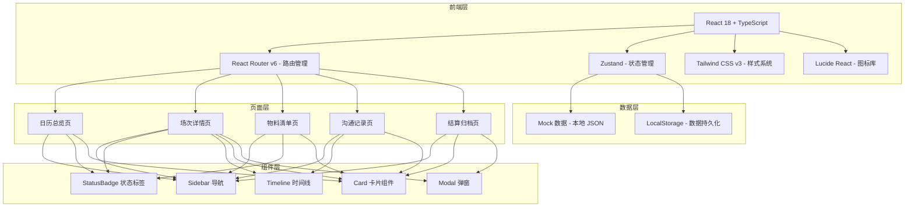
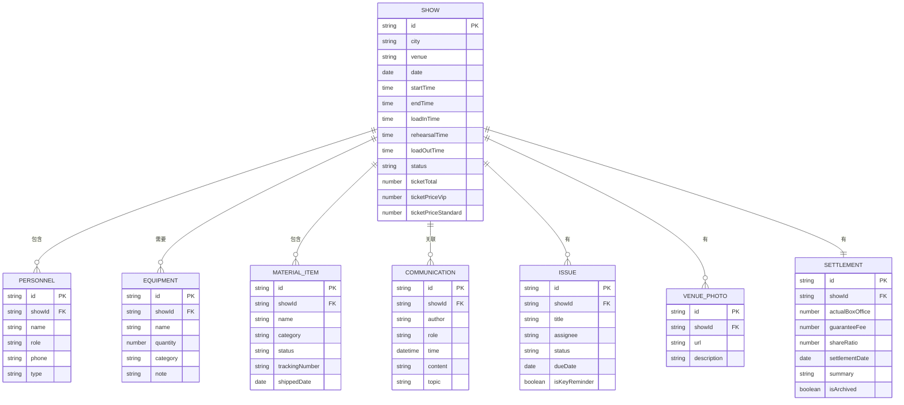

## 1. 架构设计



## 2. 技术选型说明

- **前端框架**：React 18 + TypeScript
  - 组件化开发，类型安全
  - 生态成熟，组件库丰富
- **构建工具**：Vite
  - 启动快，热更新即时
  - 原生 ESM 支持
- **状态管理**：Zustand
  - 轻量，API 简洁
  - 无需 Provider 包裹
  - 支持中间件（persist）
- **样式方案**：Tailwind CSS v3
  - 原子化 CSS，开发效率高
  - 自定义设计系统配置
  - 响应式设计便捷
- **图标库**：Lucide React
  - 线性风格统一
  - 按需导入，体积小
- **路由**：React Router v6
  - 声明式路由
  - 嵌套路由支持

## 3. 目录结构

```
src/
├── components/          # 通用组件
│   ├── Sidebar.tsx      # 侧边导航
│   ├── StatusBadge.tsx  # 状态标签
│   ├── Timeline.tsx     # 时间线组件
│   ├── Card.tsx         # 卡片容器
│   ├── Modal.tsx        # 弹窗
│   └── Button.tsx       # 按钮组件
├── pages/               # 页面
│   ├── Calendar.tsx     # 日历总览
│   ├── ShowDetail.tsx   # 场次详情
│   ├── Materials.tsx    # 物料清单
│   ├── Communications.tsx # 沟通记录
│   └── Settlement.tsx   # 结算归档
├── store/               # 状态管理
│   └── useTourStore.ts  # 巡演数据 store
├── types/               # TypeScript 类型
│   └── index.ts         # 类型定义
├── data/                # Mock 数据
│   └── mockData.ts      # 模拟数据
├── utils/               # 工具函数
│   └── dateUtils.ts     # 日期工具
├── App.tsx              # 根组件
├── main.tsx             # 入口
└── index.css            # 全局样式
```

## 4. 路由定义

| 路由路径 | 页面名称 | 说明 |
|----------|----------|------|
| / | 日历总览页 | 默认首页，展示巡演日历 |
| /shows/:id | 场次详情页 | 单场演出详细信息 |
| /materials | 物料清单页 | 物料状态跟踪 |
| /communications | 沟通记录页 | 沟通记录时间线 |
| /settlement | 结算归档页 | 票务结算与历史归档 |

## 5. 数据模型

### 5.1 数据模型 ER 图



### 5.2 核心类型定义

```typescript
// 场次状态
type ShowStatus = 'pending' | 'confirmed' | 'in_progress' | 'completed' | 'archived';

// 物料状态
type MaterialStatus = 'not_started' | 'in_production' | 'shipped' | 'delivered';

// 人员类型
type PersonnelType = 'cast' | 'crew';

// 设备分类
type EquipmentCategory = 'lighting' | 'sound' | 'stage' | 'video' | 'other';

// 问题状态
type IssueStatus = 'open' | 'in_progress' | 'resolved';

// 角色
type Role = 'coordinator' | 'venue_contact' | 'tech_lead';
```

## 6. 状态管理设计

使用 Zustand + persist 中间件实现：

- **tourStore**：巡演全局状态
  - shows: 所有场次列表
  - currentShowId: 当前选中场次
  - communications: 所有沟通记录
  - materials: 所有物料
  - settlements: 所有结算记录

- **主要 actions**：
  - addShow / updateShow / deleteShow
  - duplicateShow（复制上场配置）
  - addPersonnel / updatePersonnel
  - addEquipment / updateEquipment
  - updateMaterialStatus
  - addCommunication
  - addIssue / updateIssue
  - updateSettlement
  - archiveShow
```

## 7. 关键交互说明

### 7.1 复制上一场配置
- 选择要复制的源场次
- 可勾选复制项：人员、设备、物料、问题模板
- 生成新场次，日期和场馆为空，等待填写

### 7.2 物料状态流转
- 四态流转：未制作 → 制作中 → 已寄送 → 已到位
- 每个状态变更记录时间和操作人
- 状态变更时触发提醒（视觉提示）

### 7.3 交接摘要生成
- 自动汇总：基本信息、人员名单、设备清单、物料状态、待办事项
- 支持一键复制文本
- 节目单样式排版

### 7.4 关键节点提醒
- 进场前 7 天、3 天、1 天提醒
- 物料寄送截止提醒
- 结算时间节点提醒
- 页面顶部横幅展示待提醒事项
